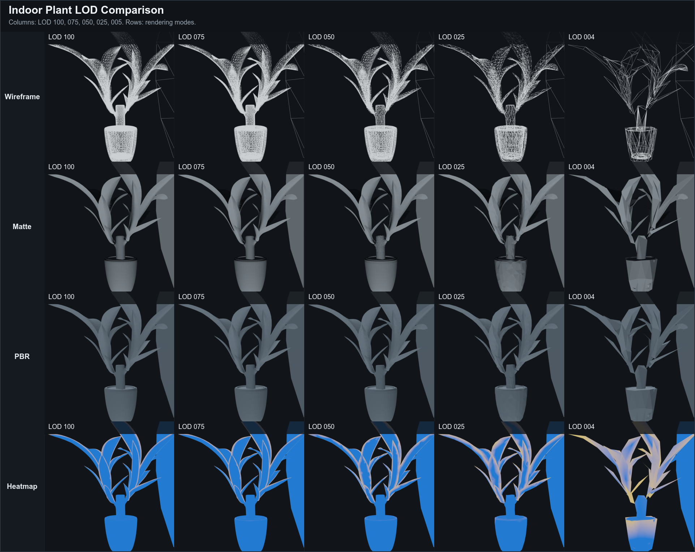
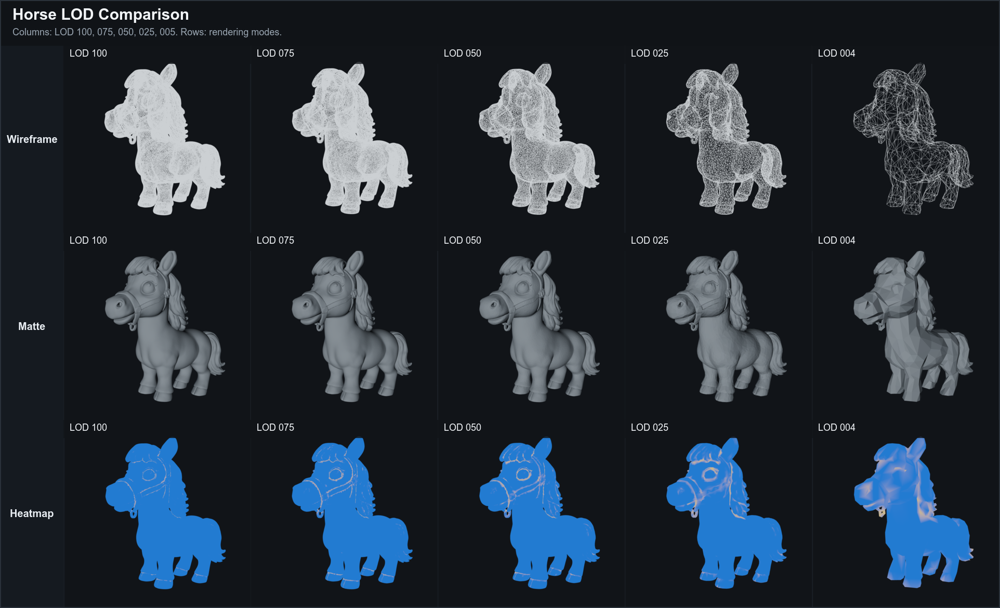
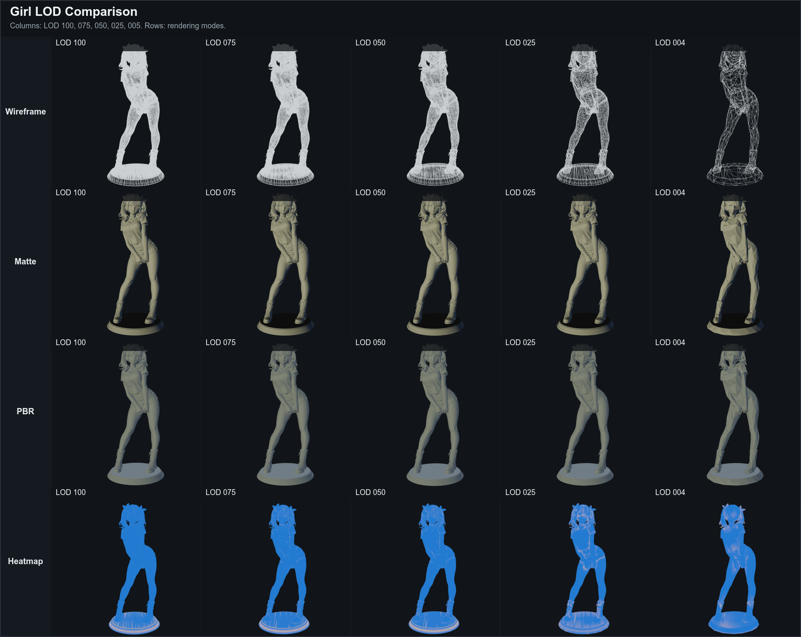
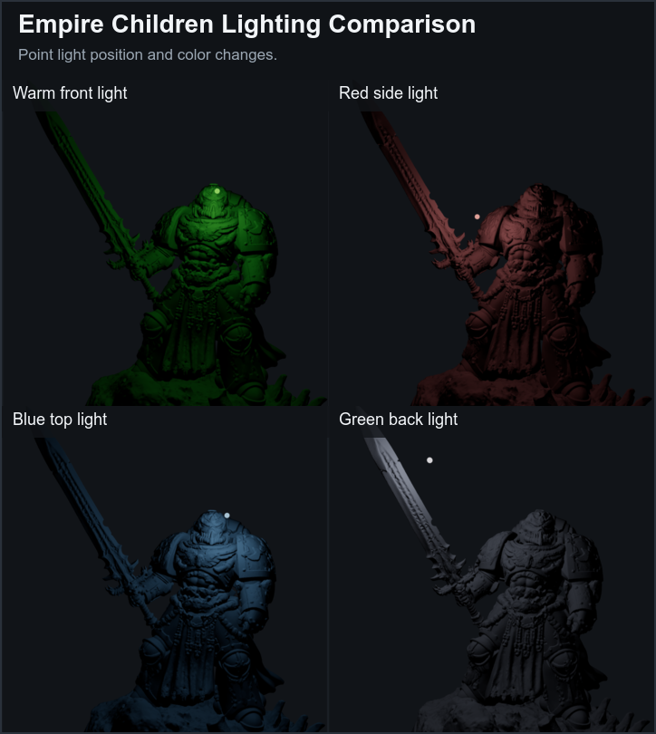
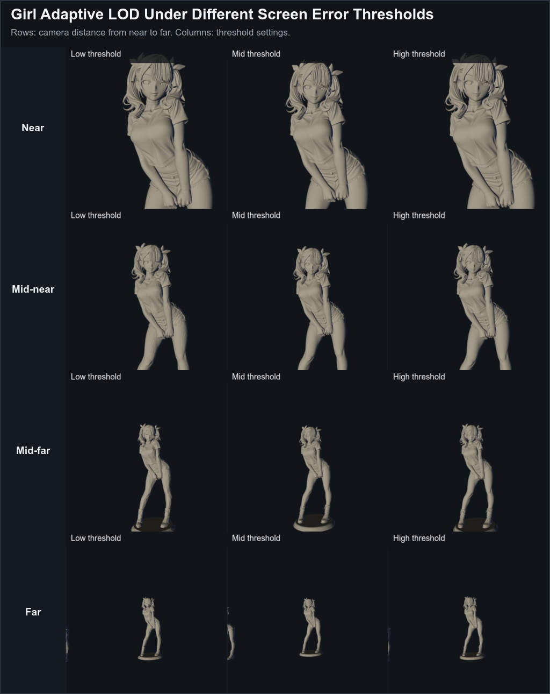

# 技术报告

题目：误差驱动的三维网格 LOD 简化与可视化系统

## 1. 项目目标

实现一个可复现、可展示、可扩展的三维网格 LOD 工具。系统支持 OBJ/3MF 输入，生成多级低精度模型，并通过 Web 界面展示手动 LOD、自适应 LOD、统计表、光照和误差热力图。

项目仓库：

```text
https://github.com/Snowed-night/mesh-lod-tool
```

输入：

- OBJ 模型：直接进入 LOD 生成流程。
- 3MF 模型：先转换为 OBJ，再进入 LOD 生成流程。

输出：

- 多个 `lod_xxx.obj` 文件。
- 每个模型对应的 CSV 统计表。
- Web 界面中的模型预览、误差-复杂度曲线、屏幕误差和热力图。

## 2. 系统结构

```text
C++ 工具
  OBJ 读写
  QEM 基线简化
  meshoptimizer 简化后端
  LOD 批量生成
  CSV 统计输出

Web 后端
  模型上传
  3MF 转 OBJ
  调用 C++ 工具
  缓存与去重

Web 前端
  Three.js 模型加载
  手动 / 自适应 LOD
  PBR 渲染
  平滑法线和阴影修正
  点光源控制
  误差热力图
  统计表和曲线
```

模块职责：

- `src/mesh/Mesh.h`：定义顶点和三角面数据结构。
- `src/mesh/ObjIO.cpp`：负责 OBJ 读取和写出。
- `src/mesh/Simplifier.cpp`：实现自写 QEM 基线。
- `src/mesh/MeshOptimizerSimplifier.cpp`：封装 meshoptimizer 后端。
- `src/main.cpp`：提供命令行入口和批量 LOD 生成。
- `web/server.js`：接收上传文件、转换 3MF、调用 C++ 工具、管理缓存。
- `web/public/main.js`：实现 Three.js 预览、自适应 LOD、热力图和光照控制。

Web 前端在加载 OBJ 后会合并重复顶点并重新计算平滑法线。法线是决定表面受光方向的向量，如果 OBJ 中相同位置的顶点被拆开，直接渲染会出现块状或波浪状明暗条纹。系统还关闭了模型本体接收自身阴影，只保留模型向地面投影，并通过 `normalBias` 减少阴影自相交。shadow acne 是阴影贴图精度不足时，模型表面错误遮挡自己形成的条纹。

## 3. 核心算法

### 3.1 QEM 基线

QEM 是 Quadric Error Metrics，意思是“二次误差度量”。本项目中的 QEM 基线使用边折叠方式简化模型。边折叠是指把一条边的两个端点合并成一个新点，从而减少顶点和三角面数量。

核心误差定义：

```text
E(v) = sum distance(v, p)^2
```

其中 `v` 是折叠后的候选新点，`p` 是原模型中相关三角面所在的平面。算法希望新点到这些平面的距离平方和尽量小。

流程：

1. 对每个三角面计算平面方程。
2. 将平面误差累加到相邻顶点，形成顶点误差矩阵。
3. 对每条候选边计算折叠代价。
4. 选择代价最小且合法的边进行折叠。
5. 重复直到达到目标三角面数或没有合法候选。

本项目还加入了两个保护策略：

- 边界保护：避免开口模型外轮廓被过度收缩。
- 法线翻转检测：避免折叠后出现三角面朝向反转。

### 3.2 meshoptimizer 后端

meshoptimizer 是面向实时渲染的开源网格优化库。本项目使用它作为复杂模型的主要简化后端。

采用该库的原因：

- 真实模型三角面数量可能达到几十万到上百万。
- 复杂模型可能包含边界、薄片、非规则拓扑和退化三角面。
- 成熟库在速度和鲁棒性上更适合最终演示。

因此，本项目采用“自实现 QEM + 工程库后端”的组合。自实现 QEM 体现算法理解，meshoptimizer 保证复杂模型效果。

### 3.3 屏幕空间误差自适应 LOD

屏幕空间误差是指几何误差投影到屏幕上后大约占多少像素。同样的几何误差，近处更明显，远处不明显，因此它比固定距离或固定比例更适合做自动 LOD 切换。

```text
world_units_per_pixel =
distance * (2 * tan(fovy / 2) / screen_height)

screen_error =
geometry_error / world_units_per_pixel
```

选择策略：

```text
从低精度 LOD 开始检查；
选择第一个 screen_error <= threshold 的 LOD；
如果都不满足，则使用最高精度 LOD。
```

### 3.4 误差热力图

热力图不等价于严格 Hausdorff 距离，而是实时结构风险可视化。Hausdorff 距离是两个几何集合之间的最大偏差，适合做严谨离线误差评估，但实时计算成本较高。

当前热力图使用：

```text
heat_score =
局部结构敏感度
+ 当前视角轮廓显著性
+ LOD 简化程度权重
```

蓝色表示风险较低，黄色表示中等风险，红色表示高风险。该热力图用于解释低精度 LOD 中哪些区域更可能出现视觉变化。

## 4. 实验结果

当前已有统计表：

```text
result/web/tables/tv_furniture_752d373f3c76_stats.csv
result/web/tables/indoor_plant_02_eafb7985f897_stats.csv
result/web/tables/horse_3d_model_4b0c341d9387_stats.csv
result/web/tables/girl_118fd17336c9_stats.csv
result/web/tables/empire_children_e259041b8b89_stats.csv
```

正文对比图选用 3 个代表模型：

- Indoor Plant：薄片和复杂结构，适合展示热力图调参。
- Horse：高面数动物模型，适合展示从高精度到低精度的连续变化。
- Girl：复杂人物模型，适合展示自适应 LOD 和局部结构变化。

点光源效果单独使用 Empire Children 展示，不放入三模型 LOD 主对比图。

实验统计如下：

| 模型 | 原始三角面 | LOD 004 三角面 | LOD 004 压缩率 | LOD 004 几何误差 | LOD 001 三角面 | 总生成耗时 |
| --- | ---: | ---: | ---: | ---: | ---: | ---: |
| Indoor Plant | 45,840 | 1,832 | 96.0% | 0.046943 | 578 | 832 ms |
| Horse | 190,272 | 7,610 | 96.0% | 0.114661 | 1,902 | 3,388 ms |
| Girl | 332,940 | 13,306 | 96.0% | 0.304080 | 3,306 | 6,754 ms |
| Empire Children | 1,331,674 | 53,255 | 96.0% | 0.116340 | 13,317 | 27,972 ms |

说明：几何误差来自 meshoptimizer 返回的简化误差并转换到模型坐标空间。不同模型的坐标尺度不同，因此绝对误差不能直接跨模型比较，更适合在同一模型不同 LOD 之间比较。

从表中可以看到，LOD 004 已经将三角面数量降低约 96%，LOD 001 进一步降低到约 1%。对于 Horse 和 Girl 这类曲面较多的模型，LOD 004 仍能保留主要轮廓；LOD 001 更适合远距离或演示低精度极限。Empire Children 原始三角面超过 133 万，仍能在 30 秒内生成完整多级 LOD，说明系统可以支撑较复杂的课程展示模型。

### 4.1 多模型 LOD 可视化

最终报告使用 3 个模型进行 LOD 可视化对比。每组横向展示 `LOD 100 / 075 / 050 / 025 / 004`，纵向展示不同渲染模式。



Indoor Plant 包含大量薄片结构，适合观察边界和细小结构在低精度 LOD 下的变化。线框模式能看到三角面逐级减少，无材质和真实材质模式能观察整体外观保持情况，热力图则突出叶片边缘等结构敏感区域。



Horse 模型用于展示动物类曲面模型的连续简化效果。该组截图未包含 PBR 模式，因此最终图使用线框、无材质和热力图三行。可以看到从 LOD 100 到 LOD 025，主体轮廓仍然较稳定；到 LOD 004 时，耳朵、鬃毛和腿部等局部细节明显减少，更适合远距离显示。



Girl 模型结构最复杂，包含头发、衣褶、鞋带和底座等细节。该模型适合展示高面数模型在不同渲染模式下的 LOD 效果，也能体现平滑法线和阴影修正后表面条纹被弱化。

### 4.2 光照效果展示



点光源实验使用 Empire Children 模型，分别改变光源位置和颜色。该图用于证明系统不仅能展示几何简化结果，也支持基础光照调节，方便后续录制答辩视频。点光源和自然光分开演示，可以避免环境光过强时看不出局部光照变化。

### 4.3 自适应 LOD 展示



自适应 LOD 使用 Girl 模型，在不同屏幕误差阈值下从近景到远景截图。阈值越低，系统越倾向于保留高精度模型；阈值越高，系统越容易选择低精度模型。该实验说明本项目不是简单按固定比例切换 LOD，而是根据当前视角下的像素误差进行选择。

## 5. 运行方式

```powershell
cmake -S . -B build
cmake --build build
```

或：

```powershell
g++ -std=c++17 -Wall -Wextra -Wpedantic -Isrc -Ithird_party/meshoptimizer/src src/main.cpp src/mesh/ObjIO.cpp src/mesh/PrimitiveMeshes.cpp src/mesh/Simplifier.cpp src/mesh/MeshOptimizerSimplifier.cpp src/viewer/Viewer.cpp third_party/meshoptimizer/src/simplifier.cpp third_party/meshoptimizer/src/allocator.cpp -lopengl32 -lgdi32 -o build-manual/mesh_lod_tool.exe
```

Web 启动：

```powershell
cd web
npm install
npm start
```

浏览器打开：

```text
http://localhost:5177
```

## 6. 结果展示素材

- 图 1：Indoor Plant 的线框、无材质、真实材质、热力图 LOD 对比，文件为 `result/report_assets/composite/fig01_indoor_plant_lod_grid.png`。
- 图 2：Horse 的线框、无材质、热力图 LOD 对比，文件为 `result/report_assets/composite/fig02_horse_lod_grid.png`。
- 图 3：Girl 的线框、无材质、真实材质、热力图 LOD 对比，文件为 `result/report_assets/composite/fig03_girl_lod_grid.png`。
- 图 4：Empire Children 的点光源位置、颜色和角度变化，文件为 `result/report_assets/composite/fig04_empire_children_lighting.png`。
- 图 5：Girl 在不同屏幕误差阈值下的自适应 LOD 切换，文件为 `result/report_assets/composite/fig05_girl_adaptive_lod.png`。
- 表格：不同模型的顶点数、三角面数、压缩率、误差和耗时。

详细素材编号见 [素材清单.md](素材清单.md)。

原先自动生成的 TV Furniture 截图已经删除，最终截图由手动截取后再合成。原始截图和合成图分别保存到：

```text
result/report_assets/raw/
result/report_assets/composite/
```

其中 `raw/` 作为本地原始素材备份，不进入 GitHub；`composite/` 中的 5 张合成图进入最终报告和 PPT。

最终演示视频保存到 `素材/截图或者视频/final_demo/`。

## 7. 项目创新点

本项目的创新点不是重新发明一个比成熟库更强的简化算法，而是在课程项目规模内完成了可解释、可复现、可展示的 LOD 系统：

- 使用自实现 QEM 作为算法基线，能解释误差矩阵和边折叠原理。
- 引入 meshoptimizer 作为复杂模型后端，解决真实模型速度和鲁棒性问题。
- 使用屏幕空间误差驱动 LOD 自动切换，而不是只按固定距离或固定比例切换。
- 设计误差热力图，把结构敏感区域和轮廓显著区域可视化。
- 实现 Web 工具，将模型上传、3MF 转 OBJ、LOD 生成、缓存复用、统计图表和可视化展示串联起来。

## 8. 可复现说明

复现实验时不要直接上传整个 `result/web/models/`，因为其中包含大量生成 OBJ 文件。推荐流程：

1. 安装 Node.js 和 C++ 编译环境。
2. 编译 `mesh_lod_tool.exe`。
3. 启动 Web 服务。
4. 在 Web 页面上传 `素材/下载模型/` 中的 OBJ 或 3MF 模型。
5. 系统会生成 `result/web/models/<job>/` 和 `result/web/tables/<job>_stats.csv`。
6. 报告中使用 CSV 表格、截图和录屏作为实验结果。
